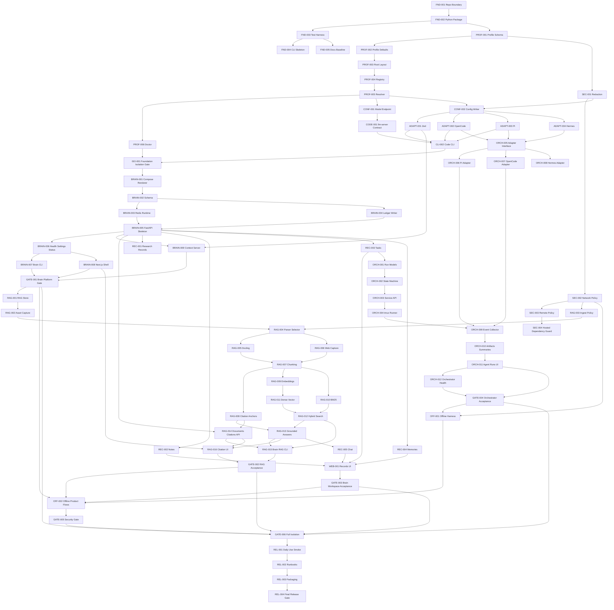

# Zsper Platform Implementation DAG Implementation Plan

> **For agentic workers:** REQUIRED SUB-SKILL: Use superpowers:subagent-driven-development (recommended) or superpowers:executing-plans to implement this plan task-by-task. Steps use checkbox (`- [ ]`) syntax for tracking.

**Goal:** Build the local-first Zsper product platform from `docs/zsper-local-ai-platform-ultimate-spec.md` as a dependency-ordered DAG of independently verifiable implementation tasks.

**Architecture:** Zsper is split into a Python-owned product core and a Next.js Brain web shell, with profile isolation as the root invariant. Python owns CLI, profiles, config generation, security policy, RAG workers, Brain API, and Zsper Orchestrator; Next.js owns the dense local workspace UI. `llm-server` remains an external model-serving dependency accessed only through command or OpenAI-compatible HTTP contracts.

**Tech Stack:** Python 3.12, Typer or Click, Pydantic, pytest, FastAPI, SQLAlchemy/Alembic, Postgres, pgvector, Redis, Docker Compose, SearXNG, Docling, local embeddings, BM25 indexing, Next.js, TypeScript, Playwright, tmux.

---

## Execution Contract

Every task below is a DAG node. A worker may start a node only when all listed dependencies are complete and verified. When implementing a node:

- [ ] Read `docs/zsper-local-ai-platform-ultimate-spec.md` and this task node.
- [ ] Inspect current files with `rg --files` and targeted reads before editing.
- [ ] Write the failing tests listed in the task.
- [ ] Run the listed test command and confirm the expected failure is for missing behavior in the task.
- [ ] Implement only the files/directories owned by the task.
- [ ] Run the task verification command and the nearest affected test subset.
- [ ] Preserve user changes and avoid unrelated refactors.
- [ ] Commit only when the execution driver explicitly requests commits; use the suggested Conventional Commit message when doing so.

## Multi-Agent Orchestration Model

The DAG is designed for hierarchical orchestration with tool-mediated coordination:

- **Coordinator:** owns dependency tracking, dispatch order, review gates, and final readiness.
- **Foundation/Profile Agent:** owns `FND-*`, `PROF-*`, `SEC-*`, `CONF-*`, `CODE-*`, `ADAPT-*`, and `CLI-*`.
- **Brain Platform Agent:** owns `BRAIN-*`, the FastAPI service skeleton, Docker Compose rendering, database schema, and Next.js shell integration.
- **RAG/Citation Agent:** owns `RAG-*`, document ingestion, Docling, chunking, citation anchors, embeddings, BM25, dense search, hybrid search, and answer citation contracts.
- **Records Agent:** owns `REC-*`, notes, tasks, memories, research records, and chat records that are not pure RAG pipeline internals.
- **Orchestrator Agent:** owns `ORCH-*`, tmux, harness adapters, events, artifacts, summaries, agent API, and Agent Runs UI.
- **Security/Release Agent:** owns `OFF-*`, `GATE-*`, and `REL-*`, and validates hosted-call bans, profile isolation, offline behavior, and daily-use acceptance.

Communication is through repository files, tests, and ledgers only. Agents must not mutate another agent's state directly; task/run state flows through Zsper Orchestrator APIs once those exist.

## Milestones

| Milestone | Goal | Exit Gate |
| --- | --- | --- |
| M0 Foundation | Repo baseline, Python package, test runner, empty CLI, architecture docs. | `pytest --collect-only` and CLI help tests pass. |
| M1 Profiles And Security Core | Work/personal/air profiles, registry, resolver, directory layout, redaction, network and remote policy primitives. | Work/personal/air profile tests pass and policy tests reject invalid states. |
| M2 Code Adapters | Model endpoint records, external `llm-server` contract, profile-local Zed/OpenCode/Pi/Hermes adapter generation. | Adapter golden tests pass and no product code imports `llm-server` internals. |
| M3 Brain Platform | Profile-specific Compose, Postgres/pgvector schema, Redis, ledgers, FastAPI skeleton, health/status/settings, Next.js shell. | `zsper brain status` reports profile-scoped service state with model serving excluded from Compose. |
| M4 Documents And RAG | Asset capture, parsing, Docling, web capture, chunking, citations, embeddings, BM25, dense vectors, hybrid search, grounded answers. | Markdown/PDF/web/repo fixtures ingest and answer with exact chunk citation objects. |
| M5 Records And Workspace | Notes, tasks, memories, research inbox, chat, web views, canonical ledgers. | Notes/tasks/memories/research/chat are profile-local and visible in the web shell. |
| M6 Orchestrator And Agent Runs | Task/run service, tmux, harness adapters, event collector, artifacts, summaries, Agent Runs UI. | A Pi run launches in tmux, streams events, attaches artifacts, completes, and can be resumed. |
| M7 Offline And Security Gates | No-network air/offline mode, hosted-call detection, remote policy checks, secret redaction, global config patch safeguards. | Forbidden hosted integrations, Funnel, cross-profile reads, and secret leaks fail tests. |
| M8 First Daily-Use Readiness | Whole-product smoke path for profiles, code, Brain, RAG, notes/tasks/memories, orchestrator, offline, and security. | `REL-004` passes and the runbook documents daily startup/shutdown/recovery. |

## DAG Overview

## File Structure Map

Create and evolve these paths as tasks require them:

| Path | Responsibility |
| --- | --- |
| `README.md` | Product purpose, local-first constraints, repo boundary with `llm-server`, quick start. |
| `pyproject.toml` | Python package metadata, CLI entry point, pytest config, dependency groups. |
| `package.json` | Workspace scripts for Brain web and any TypeScript checks. |
| `docs/architecture/` | Architecture notes derived from the ultimate spec. |
| `docs/runbooks/` | Daily use, startup/shutdown, recovery, offline, and security runbooks. |
| `docs/superpowers/plans/` | Implementation plans, including this DAG. |
| `src/zsper/cli.py` | Public `zsper` CLI composition. |
| `src/zsper/profiles/` | Profile schema, defaults, registry, resolver, init, doctor. |
| `src/zsper/security/` | Redaction, hosted-call guards, network policy, remote policy, secret policy. |
| `src/zsper/config/` | Model endpoint records and profile-local config writer. |
| `src/zsper/code/` | `llm-server` contract and editor/agent adapter generation. |
| `src/zsper/brain/` | Compose renderer, health/status commands, API support modules, ledgers. |
| `src/zsper/rag/` | Assets, parsers, chunking, citations, embeddings, indexes, search, answer flow. |
| `src/zsper/memory/` | Canonical memory event logic and Honcho sidecar integration helpers. |
| `src/zsper/orchestrator/` | Tasks/runs, tmux runner, harness adapters, event collector, artifacts, summaries. |
| `services/brain-api/` | FastAPI app, routes, migrations, API test fixtures. |
| `apps/brain-web/` | Next.js operational workspace UI. |
| `compose/` | Compose templates and service env templates. |
| `tests/unit/` | Fast unit tests for Python core. |
| `tests/integration/` | Profile, Brain, RAG, orchestration, and offline integration tests. |
| `tests/security/` | Hosted-call bans, redaction, remote policy, cross-profile leakage tests. |
| `tests/fixtures/` | Documents, profiles, local API responses, sample harness output. |

## Phase 1: Foundation

### FND-001: Repository Boundary And README

**Milestone:** M0 Foundation  
**Dependencies:** none  
**Owner:** Foundation/Profile Agent  
**Files:**
- Create: `README.md`
- Create: `docs/architecture/repository-boundary.md`
- Test: `tests/unit/test_docs_boundary.py`

**Goal:** Make the `zsper` vs `llm-server` boundary explicit before product code exists.

**Requirements:**
- State that `/Users/michaelasper/source/llm-server` owns model deployment and oMLX serving.
- State that `/Users/michaelasper/source/zsper` owns profiles, CLI, configs, Brain, RAG, orchestrator, docs, and tests.
- List allowed dependency forms: environment variable, command template, deploy contract file, and local OpenAI-compatible HTTP.
- List disallowed dependency forms: importing benchmark internals, storing profile data in `llm-server`, generating adapters from `llm-server`, adding Brain/RAG/memory/tasks to `llm-server`.

**Acceptance Checks:**
- `README.md` links to the ultimate spec.
- Boundary language includes `benchmarks.local_server` as a forbidden import.
- No source file under `src/zsper/` imports from `/Users/michaelasper/source/llm-server`.

**Verification:**
- Run: `pytest tests/unit/test_docs_boundary.py -v`
- Expected: README and architecture boundary assertions pass.

**Suggested Commit:** `docs: document zsper repository boundary`

### FND-002: Python Project Scaffold

**Milestone:** M0 Foundation  
**Dependencies:** `FND-001`  
**Owner:** Foundation/Profile Agent  
**Files:**
- Create: `pyproject.toml`
- Create: `src/zsper/__init__.py`
- Create: `src/zsper/__main__.py`
- Create: `tests/unit/test_package.py`

**Goal:** Create an installable Python package that can host CLI, profile, Brain API, RAG, and orchestrator modules.

**Requirements:**
- Configure package discovery under `src/`.
- Configure pytest defaults.
- Include dependency groups for CLI, API, database, RAG, web integration tests, and development checks.
- Expose a `zsper` console script pointing at `src/zsper/cli.py`.

**Acceptance Checks:**
- `python -m zsper --help` exits cleanly after `FND-004`.
- `python -c "import zsper; print(zsper.__version__)"` prints a version string.
- `pytest --collect-only` runs without import errors.

**Verification:**
- Run: `pytest tests/unit/test_package.py -v`
- Expected: package import and version tests pass.

**Suggested Commit:** `build: scaffold python package`

### FND-003: Test Harness And Fixture Roots

**Milestone:** M0 Foundation  
**Dependencies:** `FND-002`  
**Owner:** Foundation/Profile Agent  
**Files:**
- Create: `tests/conftest.py`
- Create: `tests/fixtures/README.md`
- Create: `tests/unit/test_test_harness.py`
- Create: `tests/integration/.gitkeep`
- Create: `tests/security/.gitkeep`

**Goal:** Establish isolated test fixtures before profile and filesystem behavior exists.

**Requirements:**
- Provide a fixture for temporary profile roots.
- Provide a fixture for an isolated registry path.
- Ensure tests never write to the real home directory by default.
- Provide marker definitions for unit, integration, e2e, security, and slow tests.

**Acceptance Checks:**
- Test fixture roots are unique per test.
- No test writes under `/Users/michaelasper` unless the test explicitly opts into a real integration path.

**Verification:**
- Run: `pytest tests/unit/test_test_harness.py -v`
- Expected: fixture isolation assertions pass.

**Suggested Commit:** `test: add isolated test harness`

### FND-004: CLI Skeleton

**Milestone:** M0 Foundation  
**Dependencies:** `FND-002`, `FND-003`  
**Owner:** Foundation/Profile Agent  
**Files:**
- Create: `src/zsper/cli.py`
- Create: `tests/unit/test_cli_help.py`

**Goal:** Provide the public `zsper` command with empty groups that later tasks fill in.

**Requirements:**
- Add groups: `profile`, `code`, `brain`, `agent`.
- Reserve commands matching the spec: `profile init/list/show/doctor`, `code start/stop/status/smoke/install-zed/install-opencode/install-pi`, `brain up/down/status/ingest/search/answer`, `agent run/attach/status/cancel`.
- Every operational command must accept or resolve `--profile`.

**Acceptance Checks:**
- `zsper --help` shows all groups.
- Group help renders without side effects.
- Placeholder commands return a clear "not implemented in this milestone" message until their implementation task lands.

**Verification:**
- Run: `pytest tests/unit/test_cli_help.py -v`
- Expected: help output includes all required groups and command names.

**Suggested Commit:** `feat(cli): add zsper command skeleton`

### FND-005: Architecture And Runbook Baseline

**Milestone:** M0 Foundation  
**Dependencies:** `FND-001`, `FND-004`  
**Owner:** Foundation/Profile Agent  
**Files:**
- Create: `docs/architecture/platform-overview.md`
- Create: `docs/runbooks/local-development.md`
- Create: `docs/runbooks/testing.md`
- Test: `tests/unit/test_docs_links.py`

**Goal:** Give future implementers a stable orientation layer for the platform and test commands.

**Requirements:**
- Summarize the seven implementation phases from the ultimate spec.
- Explain that `zsper-brain` is the product shell and `zsper-code` is the local model adapter layer.
- Document the standard commands for unit, integration, security, web, and full smoke verification.

**Acceptance Checks:**
- Docs link to the ultimate spec and this plan.
- Test runbook includes exact commands with expected purpose.

**Verification:**
- Run: `pytest tests/unit/test_docs_links.py -v`
- Expected: all referenced local docs exist.

**Suggested Commit:** `docs: add platform orientation docs`

## Phase 2: Profiles, Security Core, And Code Adapters

### PROF-001: Profile Schema

**Milestone:** M1 Profiles And Security Core  
**Dependencies:** `FND-002`, `FND-003`  
**Owner:** Foundation/Profile Agent  
**Files:**
- Create: `src/zsper/profiles/schema.py`
- Create: `src/zsper/profiles/__init__.py`
- Test: `tests/unit/profiles/test_schema.py`

**Goal:** Encode the `Profile` record from the spec.

**Requirements:**
- Fields: `schema_version`, `name`, `mode`, `root`, `model_profile`, `long_context_fallback`, `embedding_profile`, `storage_backend`, `remote_access_policy`, `network_policy`, `database_name`, `created_at`, `updated_at`.
- Modes: `work`, `personal`, `air-offline`.
- Storage backends: `postgres-pgvector`, `sqlite-local`.
- Remote access policies: `disabled`, `tailscale-serve-only`.
- Network policies: `local-first`, `offline`.
- Normalize `root` to an absolute path.

**Acceptance Checks:**
- Valid profile JSON round-trips.
- Invalid enum values fail validation.
- Relative roots are normalized before persistence.

**Verification:**
- Run: `pytest tests/unit/profiles/test_schema.py -v`
- Expected: schema validation and serialization tests pass.

**Suggested Commit:** `feat(profiles): add profile schema`

### PROF-002: Mode Defaults And Invariants

**Milestone:** M1 Profiles And Security Core  
**Dependencies:** `PROF-001`  
**Owner:** Foundation/Profile Agent  
**Files:**
- Create: `src/zsper/profiles/defaults.py`
- Test: `tests/unit/profiles/test_defaults.py`

**Goal:** Encode work, personal, and air/offline defaults from the spec.

**Requirements:**
- Work: `remote_access_policy=disabled`, `network_policy=local-first`, `model_profile=zsper-qwen35-oq6-fp16-mtp-omlx-128k`, `long_context_fallback=None`, `storage_backend=postgres-pgvector`, `embedding_profile=local-bge-small-en-v1.5`.
- Personal: `remote_access_policy=tailscale-serve-only`, `network_policy=local-first`, primary model, `long_context_fallback=zsper-qwen35-oq6-omlx-256k`, `storage_backend=postgres-pgvector`, `embedding_profile=local-bge-small-en-v1.5`.
- Air/offline: `remote_access_policy=disabled`, `network_policy=offline`, `model_profile=zsper-air-gemma4-12b-it-6bit-128k`, `long_context_fallback=None`, `storage_backend=sqlite-local` for first offline iteration, `embedding_profile=local-small-embedding`.
- Reject `mode=work` with personal remote defaults.
- Reject `mode=air-offline` with `network_policy=local-first`.

**Acceptance Checks:**
- Defaults match the spec text exactly.
- Invalid mode/policy combinations fail before any filesystem mutation.

**Verification:**
- Run: `pytest tests/unit/profiles/test_defaults.py -v`
- Expected: mode defaults and invariant tests pass.

**Suggested Commit:** `feat(profiles): add mode defaults`

### PROF-003: Profile Root Layout Initializer

**Milestone:** M1 Profiles And Security Core  
**Dependencies:** `PROF-001`, `PROF-002`  
**Owner:** Foundation/Profile Agent  
**Files:**
- Create: `src/zsper/profiles/init.py`
- Test: `tests/unit/profiles/test_init.py`

**Goal:** Create isolated profile roots and write `profile.json`.

**Requirements:**
- Create the full root layout: `secrets/`, `runtime/code/`, `runtime/brain/`, `runtime/agents/`, `models/huggingface/`, `models/embeddings/`, `code/zed/`, `code/opencode/`, `code/pi/`, `code/hermes/`, `brain/assets/`, `brain/parsed/`, `brain/ledgers/`, `brain/notes/`, `brain/tasks/`, `brain/memory/`, `brain/documents/`, `brain/citations/`, `agent-runs/events/`, `agent-runs/artifacts/`, `agent-runs/summaries/`, `logs/`.
- Write `profile.json` as the source of truth.
- Create empty `agent-runs/runs.jsonl`.
- Refuse a target root that already contains a profile unless an explicit recovery command is added in a separate task.

**Acceptance Checks:**
- Work and personal roots have identical directory shape.
- Runtime deletion does not remove canonical `brain/`, `agent-runs/`, or `secrets/` data.
- Duplicate initialization fails with a clear profile-root-in-use error.

**Verification:**
- Run: `pytest tests/unit/profiles/test_init.py -v`
- Expected: exact directory layout and duplicate-root tests pass.

**Suggested Commit:** `feat(profiles): initialize profile roots`

### PROF-004: Profile Registry

**Milestone:** M1 Profiles And Security Core  
**Dependencies:** `PROF-003`  
**Owner:** Foundation/Profile Agent  
**Files:**
- Create: `src/zsper/profiles/registry.py`
- Test: `tests/unit/profiles/test_registry.py`

**Goal:** Track known profiles without relying on shell history or global application state.

**Requirements:**
- Registry path must be configurable by environment and test fixtures.
- Registry entries include profile name, root, mode, database name, created timestamp, and updated timestamp.
- Prevent duplicate names and duplicate roots.
- Do not store secrets in the registry.

**Acceptance Checks:**
- `profile list` can read initialized profiles through the registry.
- Duplicate name/root writes fail before registry mutation.

**Verification:**
- Run: `pytest tests/unit/profiles/test_registry.py -v`
- Expected: registry add/list/update and duplicate tests pass.

**Suggested Commit:** `feat(profiles): add profile registry`

### PROF-005: Profile Resolver

**Milestone:** M1 Profiles And Security Core  
**Dependencies:** `PROF-004`  
**Owner:** Foundation/Profile Agent  
**Files:**
- Create: `src/zsper/profiles/resolver.py`
- Test: `tests/unit/profiles/test_resolver.py`

**Goal:** Resolve profile inputs by name or absolute root for every operational command.

**Requirements:**
- Accept profile name, profile root, or explicit `profile.json` path.
- Validate that the resolved profile matches the registry entry when one exists.
- Reject ambiguous names.
- Return a loaded `Profile` object plus root paths for profile-local data.

**Acceptance Checks:**
- Commands can use `--profile work` or `--profile /abs/path/to/profile`.
- Resolver refuses cross-profile roots that do not match stored metadata.

**Verification:**
- Run: `pytest tests/unit/profiles/test_resolver.py -v`
- Expected: name/root/path resolution and ambiguity tests pass.

**Suggested Commit:** `feat(profiles): resolve profiles by name or root`

### SEC-001: Secret Redaction

**Milestone:** M1 Profiles And Security Core  
**Dependencies:** `PROF-001`  
**Owner:** Foundation/Profile Agent  
**Files:**
- Create: `src/zsper/security/redaction.py`
- Create: `src/zsper/security/__init__.py`
- Test: `tests/unit/security/test_redaction.py`

**Goal:** Centralize redaction rules before ledgers, logs, diffs, and config patching exist.

**Requirements:**
- Redact keys named `apiKey`, `api_key`, `token`, `authorization`, `password`, `secret`, and case variants.
- Redact nested dictionaries and lists.
- Preserve non-secret shape so diffs and ledgers remain useful.

**Acceptance Checks:**
- Redaction handles JSON-compatible structures.
- Secret values never appear in redacted output.

**Verification:**
- Run: `pytest tests/unit/security/test_redaction.py -v`
- Expected: redaction table and nested-structure tests pass.

**Suggested Commit:** `feat(security): add secret redaction`

### SEC-002: Network Policy

**Milestone:** M1 Profiles And Security Core  
**Dependencies:** `PROF-002`, `SEC-001`  
**Owner:** Foundation/Profile Agent  
**Files:**
- Create: `src/zsper/security/network_policy.py`
- Test: `tests/unit/security/test_network_policy.py`

**Goal:** Enforce local-first and offline behavior consistently.

**Requirements:**
- `local-first` allows localhost services, local SearXNG when configured, and explicit user-triggered web capture.
- `local-first` blocks hosted integrations unless plugin policy enables them.
- `offline` allows localhost services and user-selected local file reads.
- `offline` blocks URLs, SearXNG, hosted integrations, hosted model APIs, hosted search APIs, hosted extraction APIs, and model artifact downloads.

**Acceptance Checks:**
- URL ingestion and SearXNG search fail for air/offline profiles.
- Hosted model/search/extraction hosts fail by default.

**Verification:**
- Run: `pytest tests/unit/security/test_network_policy.py -v`
- Expected: local-first and offline allow/deny matrix passes.

**Suggested Commit:** `feat(security): add network policy`

### SEC-003: Remote Access Policy

**Milestone:** M1 Profiles And Security Core  
**Dependencies:** `PROF-002`, `SEC-002`  
**Owner:** Foundation/Profile Agent  
**Files:**
- Create: `src/zsper/security/remote_policy.py`
- Test: `tests/unit/security/test_remote_policy.py`

**Goal:** Encode Tailscale and work/personal remote access rules.

**Requirements:**
- Work remote access defaults to disabled.
- Personal remote access may use Tailscale Serve only.
- Tailscale Funnel is forbidden for all profile modes.
- Air/offline remote access is disabled.

**Acceptance Checks:**
- Any policy containing Funnel is rejected.
- Personal Serve is allowed.
- Work private tailnet exposure requires an explicit local policy file in a later remote command task.

**Verification:**
- Run: `pytest tests/unit/security/test_remote_policy.py -v`
- Expected: remote policy matrix passes.

**Suggested Commit:** `feat(security): add remote policy`

### SEC-004: Hosted Dependency Guard

**Milestone:** M1 Profiles And Security Core  
**Dependencies:** `SEC-002`, `SEC-003`  
**Owner:** Security/Release Agent  
**Files:**
- Create: `src/zsper/security/hosted_dependencies.py`
- Test: `tests/security/test_hosted_dependency_guard.py`

**Goal:** Detect forbidden core dependencies early.

**Requirements:**
- Core flows must not require hosted model APIs, hosted search APIs, hosted extraction APIs, Notion, Linear, Open WebUI, Paperclip, Ruflo, or OpenClaw.
- Future plugins may reference these systems only through plugin metadata that declares network behavior, secret requirements, profile scope, and disabled-by-default status.
- The guard must distinguish core code from future plugin folders once plugin folders exist.

**Acceptance Checks:**
- Scans over `src/zsper/` fail on forbidden hosted dependency names in core runtime modules.
- Docs may mention future plugin policy without failing.

**Verification:**
- Run: `pytest tests/security/test_hosted_dependency_guard.py -v`
- Expected: forbidden core dependency detection tests pass.

**Suggested Commit:** `test(security): guard hosted dependencies`

### PROF-006: Profile Doctor

**Milestone:** M1 Profiles And Security Core  
**Dependencies:** `PROF-005`, `SEC-001`, `SEC-002`, `SEC-003`, `SEC-004`  
**Owner:** Foundation/Profile Agent  
**Files:**
- Create: `src/zsper/profiles/doctor.py`
- Test: `tests/unit/profiles/test_doctor.py`

**Goal:** Provide profile health checks used by CLI, Brain API, and release gates.

**Requirements:**
- Verify profile exists and matches schema.
- Verify required directories are present and writable.
- Verify secrets directory exists without reading secret values.
- Verify runtime directories are writable.
- Verify remote access policy and network policy.
- Verify no forbidden hosted integration is configured in core profile settings.

**Acceptance Checks:**
- Healthy work/personal/air profiles pass.
- Missing canonical directories, invalid policy, and forbidden hosted config fail with actionable messages.

**Verification:**
- Run: `pytest tests/unit/profiles/test_doctor.py -v`
- Expected: doctor pass/fail cases pass.

**Suggested Commit:** `feat(profiles): add profile doctor`

### CLI-001: Profile CLI Commands

**Milestone:** M1 Profiles And Security Core  
**Dependencies:** `FND-004`, `PROF-003`, `PROF-004`, `PROF-005`, `PROF-006`  
**Owner:** Foundation/Profile Agent  
**Files:**
- Modify: `src/zsper/cli.py`
- Create: `src/zsper/profiles/commands.py`
- Test: `tests/unit/profiles/test_cli.py`

**Goal:** Implement `zsper profile init/list/show/doctor`.

**Requirements:**
- `profile init --mode work|personal|air-offline --root <path>` creates the profile root, writes `profile.json`, and registers it.
- `profile list` reads the registry.
- `profile show --profile <name-or-root>` prints profile metadata without secrets.
- `profile doctor --profile <name-or-root>` runs doctor checks.

**Acceptance Checks:**
- Commands work with isolated test registry.
- Output includes profile id/name/mode/root and excludes secret values.

**Verification:**
- Run: `pytest tests/unit/profiles/test_cli.py -v`
- Expected: profile CLI command tests pass.

**Suggested Commit:** `feat(cli): add profile commands`

### CONF-001: Model Endpoint Records

**Milestone:** M2 Code Adapters  
**Dependencies:** `PROF-002`  
**Owner:** Foundation/Profile Agent  
**Files:**
- Create: `src/zsper/config/model_endpoint.py`
- Create: `src/zsper/config/__init__.py`
- Test: `tests/unit/config/test_model_endpoint.py`

**Goal:** Map profile model settings to stable OpenAI-compatible endpoint records.

**Requirements:**
- Primary endpoint: provider `zsper-code`, base URL `http://127.0.0.1:9127/v1`, model `zsper-qwen35-oq6-fp16-mtp-omlx-128k`, context window `131072`, output limit `4096`, tool support `true`, health path `/models`.
- Personal fallback endpoint: provider `zsper-code-long`, model `zsper-qwen35-oq6-omlx-256k`, context window `262144`.
- Air/offline endpoint: provider `zsper-air-code`, model `zsper-air-gemma4-12b-it-6bit-128k`, context window `131072`.

**Acceptance Checks:**
- Endpoint records serialize to JSON-compatible dictionaries.
- Personal profiles expose both primary and long-context fallback when requested.

**Verification:**
- Run: `pytest tests/unit/config/test_model_endpoint.py -v`
- Expected: endpoint rendering tests pass.

**Suggested Commit:** `feat(config): add model endpoint records`

### CODE-001: External llm-server Contract

**Milestone:** M2 Code Adapters  
**Dependencies:** `CONF-001`, `SEC-002`, `SEC-004`  
**Owner:** Foundation/Profile Agent  
**Files:**
- Create: `src/zsper/code/llm_server_contract.py`
- Create: `src/zsper/code/__init__.py`
- Test: `tests/unit/code/test_llm_server_contract.py`
- Test: `tests/security/test_llm_server_boundary.py`

**Goal:** Delegate model serving to `llm-server` without importing `llm-server` internals.

**Requirements:**
- Support environment variable `ZSPER_LLM_SERVER_DIR=/Users/michaelasper/source/llm-server`.
- Support configured command templates such as `mise -C "$ZSPER_LLM_SERVER_DIR" run prod-start-zsper`.
- Support HTTP status checks to `/v1/models`.
- Support smoke chat completion to `/v1/chat/completions`.
- Product tests must mock subprocess and HTTP calls.
- No import from `benchmarks.local_server` or any `llm-server` Python module.

**Acceptance Checks:**
- `status` checks the local OpenAI-compatible endpoint.
- `start` and `stop` render commands without shell mutation.
- Boundary scan fails if a product module imports `llm-server` benchmark internals.

**Verification:**
- Run: `pytest tests/unit/code/test_llm_server_contract.py tests/security/test_llm_server_boundary.py -v`
- Expected: mocked contract and boundary tests pass.

**Suggested Commit:** `feat(code): add external model server contract`

### CONF-002: Profile-Local Config Writer

**Milestone:** M2 Code Adapters  
**Dependencies:** `PROF-005`, `SEC-001`, `CONF-001`  
**Owner:** Foundation/Profile Agent  
**Files:**
- Create: `src/zsper/config/writer.py`
- Create: `src/zsper/code/adapters/base.py`
- Test: `tests/unit/config/test_writer.py`

**Goal:** Provide safe, profile-local config writing for all adapter generators.

**Requirements:**
- Write only under `<profile-root>/code/*` by default.
- Create parent directories when missing.
- Produce deterministic JSON/YAML/text output.
- Provide an explicit global patch interface that creates backups and redacted diffs; no adapter uses it by default.
- Use local sentinel API keys for local OpenAI-compatible endpoints.

**Acceptance Checks:**
- Attempted write outside profile root fails.
- Redacted diff omits secret values.
- Default adapter generation does not touch global config files.

**Verification:**
- Run: `pytest tests/unit/config/test_writer.py -v`
- Expected: profile-local write, path safety, backup, and redacted diff tests pass.

**Suggested Commit:** `feat(config): add profile-local config writer`

### ADAPT-001: Zed Adapter

**Milestone:** M2 Code Adapters  
**Dependencies:** `CONF-002`  
**Owner:** Foundation/Profile Agent  
**Files:**
- Create: `src/zsper/code/adapters/zed.py`
- Test: `tests/unit/code/test_zed_adapter.py`

**Goal:** Generate profile-local Zed config for local model access.

**Requirements:**
- Generate `<profile-root>/code/zed/settings.json`.
- Generate `<profile-root>/code/zed/context_servers.json`.
- Use OpenAI-compatible provider config pointing to `http://127.0.0.1:9127/v1`.
- Use the Zsper model profile id, not a raw Hugging Face reference.
- Point the context server to `zsper brain context-server`.

**Acceptance Checks:**
- Generated JSON parses.
- Work and personal config files differ only where profile-specific paths or model fallback settings require it.

**Verification:**
- Run: `pytest tests/unit/code/test_zed_adapter.py -v`
- Expected: Zed golden-file tests pass.

**Suggested Commit:** `feat(code): generate zed adapter config`

### ADAPT-002: OpenCode Adapter

**Milestone:** M2 Code Adapters  
**Dependencies:** `CONF-002`  
**Owner:** Foundation/Profile Agent  
**Files:**
- Create: `src/zsper/code/adapters/opencode.py`
- Test: `tests/unit/code/test_opencode_adapter.py`

**Goal:** Generate profile-local OpenCode provider config.

**Requirements:**
- Generate `<profile-root>/code/opencode/opencode.json`.
- Use provider `@ai-sdk/openai-compatible`.
- Use agent name `zsper-code`.
- Use local base URL and profile model id/context limits.
- Use local sentinel API key and require no hosted API key.

**Acceptance Checks:**
- Generated JSON parses.
- Config uses only local endpoint details.

**Verification:**
- Run: `pytest tests/unit/code/test_opencode_adapter.py -v`
- Expected: OpenCode golden-file tests pass.

**Suggested Commit:** `feat(code): generate opencode adapter config`

### ADAPT-003: Pi And little-coder Adapter

**Milestone:** M2 Code Adapters  
**Dependencies:** `CONF-002`  
**Owner:** Foundation/Profile Agent  
**Files:**
- Create: `src/zsper/code/adapters/pi.py`
- Test: `tests/unit/code/test_pi_adapter.py`

**Goal:** Generate a profile-local Pi provider package and little-coder guidance.

**Requirements:**
- Generate `<profile-root>/code/pi/pi-provider.yml`.
- Generate `<profile-root>/code/pi/AGENTS.md`.
- Generate `<profile-root>/code/pi/little-coder.md`.
- Include short loops, explicit file reads, small diffs, deterministic checks, and conservative task expansion.
- Work without global shell mutation.

**Acceptance Checks:**
- YAML parses.
- Guidance files include local-model and small-diff conventions.
- Paths are profile-local.

**Verification:**
- Run: `pytest tests/unit/code/test_pi_adapter.py -v`
- Expected: Pi adapter content and YAML tests pass.

**Suggested Commit:** `feat(code): generate pi adapter package`

### ADAPT-004: Hermes Launcher Adapter Config

**Milestone:** M2 Code Adapters  
**Dependencies:** `CONF-002`  
**Owner:** Foundation/Profile Agent  
**Files:**
- Create: `src/zsper/code/adapters/hermes.py`
- Test: `tests/unit/code/test_hermes_adapter_config.py`

**Goal:** Generate optional Hermes launcher profile config under the profile root.

**Requirements:**
- Generate files under `<profile-root>/code/hermes/`.
- Mark Hermes as launch-oriented and optional.
- Do not make Hermes a core orchestrator or state owner.

**Acceptance Checks:**
- Absence of Hermes global installation does not fail other adapter generation.
- Generated profile references the local endpoint and profile model id.

**Verification:**
- Run: `pytest tests/unit/code/test_hermes_adapter_config.py -v`
- Expected: Hermes optional config tests pass.

**Suggested Commit:** `feat(code): generate hermes launcher profile`

### CLI-002: Code CLI Commands

**Milestone:** M2 Code Adapters  
**Dependencies:** `FND-004`, `CODE-001`, `ADAPT-001`, `ADAPT-002`, `ADAPT-003`, `ADAPT-004`  
**Owner:** Foundation/Profile Agent  
**Files:**
- Modify: `src/zsper/cli.py`
- Create: `src/zsper/code/commands.py`
- Test: `tests/unit/code/test_cli.py`

**Goal:** Implement `zsper code start/stop/status/smoke/install-zed/install-opencode/install-pi`.

**Requirements:**
- `start`, `stop`, `status`, and `smoke` delegate to the external `llm-server` contract.
- `install-zed`, `install-opencode`, and `install-pi` write profile-local adapter configs.
- No global configs are patched by default.
- Commands require a resolved profile.

**Acceptance Checks:**
- Adapter install commands create expected profile-local files.
- Status and smoke commands use mocked contract in tests.

**Verification:**
- Run: `pytest tests/unit/code/test_cli.py -v`
- Expected: code CLI command tests pass.

**Suggested Commit:** `feat(cli): add code commands`

### ISO-001: Foundation Profile Isolation Gate

**Milestone:** M2 Code Adapters  
**Dependencies:** `CLI-001`, `CLI-002`, `SEC-004`  
**Owner:** Security/Release Agent  
**Files:**
- Create: `tests/integration/test_profile_isolation_foundation.py`
- Create: `tests/fixtures/profiles/README.md`

**Goal:** Prove work and personal separation before Brain/RAG/orchestrator work starts.

**Requirements:**
- Initialize work and personal profiles.
- Assert different roots, database names, secret directories, generated client configs, runtime directories, code adapter files, and agent run ledgers.
- Assert generated configs do not contain hosted API keys.
- Assert no cross-profile resolver lookup returns the wrong root.

**Acceptance Checks:**
- Work and personal profiles can run the same code-adapter setup without shared state.

**Verification:**
- Run: `pytest tests/integration/test_profile_isolation_foundation.py -v`
- Expected: foundation isolation tests pass.

**Suggested Commit:** `test: prove foundation profile isolation`

## Phase 3: Brain Platform

### BRAIN-001: Profile-Specific Compose Renderer

**Milestone:** M3 Brain Platform  
**Dependencies:** `ISO-001`  
**Owner:** Brain Platform Agent  
**Files:**
- Create: `compose/brain.compose.yml.j2`
- Create: `compose/brain.env.j2`
- Create: `src/zsper/brain/compose.py`
- Create: `src/zsper/brain/__init__.py`
- Test: `tests/unit/brain/test_compose.py`

**Goal:** Render Docker Compose and env files per profile.

**Requirements:**
- Include Postgres + pgvector, Redis, SearXNG, Honcho, Brain API, and Next.js web.
- Exclude model serving from Brain Compose.
- Render `<profile-root>/brain/docker-compose.yml`.
- Render `<profile-root>/brain/.env`.
- Use profile-specific database names, volumes, ports, and roots.

**Acceptance Checks:**
- Work and personal rendered Compose files have distinct database names and volumes.
- Brain Compose does not include `llm-server` model serving.

**Verification:**
- Run: `pytest tests/unit/brain/test_compose.py -v`
- Expected: Compose and env snapshot tests pass.

**Suggested Commit:** `feat(brain): render profile compose`

### BRAIN-002: Postgres And pgvector Schema

**Milestone:** M3 Brain Platform  
**Dependencies:** `BRAIN-001`  
**Owner:** Brain Platform Agent  
**Files:**
- Create: `services/brain-api/migrations/0001_initial.sql`
- Create: `src/zsper/brain/db/schema.py`
- Create: `src/zsper/brain/db/__init__.py`
- Test: `tests/unit/brain/test_schema_sql.py`
- Test: `tests/integration/brain/test_postgres_schema.py`

**Goal:** Define canonical storage for work and personal profiles.

**Requirements:**
- Enable pgvector.
- Create tables for documents, document chunks, citation anchors, notes, tasks, memory events, research records, chat sessions, chat messages, agent runs, agent run events, settings, and profile metadata.
- Include profile scoping on every user record.
- Include full-text/BM25-ready indexes and vector indexes where appropriate.
- Emit `<profile-root>/brain/schema.sql` during profile Brain setup.

**Acceptance Checks:**
- Fresh database migration succeeds.
- Foreign keys enforce profile-scoped records.
- pgvector extension is present.

**Verification:**
- Run: `pytest tests/unit/brain/test_schema_sql.py tests/integration/brain/test_postgres_schema.py -v`
- Expected: schema rendering and migration tests pass.

**Suggested Commit:** `feat(brain): add postgres pgvector schema`

### BRAIN-003: Redis Runtime Integration

**Milestone:** M3 Brain Platform  
**Dependencies:** `BRAIN-001`, `BRAIN-002`  
**Owner:** Brain Platform Agent  
**Files:**
- Create: `src/zsper/brain/redis.py`
- Create: `services/brain-api/app/deps.py`
- Test: `tests/unit/brain/test_redis.py`

**Goal:** Provide Redis as runtime support without making it canonical storage.

**Requirements:**
- Redis client is profile-aware through service env.
- Redis can be used for cache/job coordination.
- Canonical documents, notes, tasks, memory events, agent runs, and ledgers remain outside Redis.

**Acceptance Checks:**
- Health checks can report Redis separately.
- Tests prove no canonical record type is stored only in Redis.

**Verification:**
- Run: `pytest tests/unit/brain/test_redis.py -v`
- Expected: Redis config and non-canonical-storage tests pass.

**Suggested Commit:** `feat(brain): add redis runtime integration`

### BRAIN-004: Canonical Ledger Writer

**Milestone:** M3 Brain Platform  
**Dependencies:** `BRAIN-002`, `SEC-001`  
**Owner:** Brain Platform Agent  
**Files:**
- Create: `src/zsper/brain/ledgers.py`
- Test: `tests/unit/brain/test_ledgers.py`

**Goal:** Mirror mutating records to profile-local append-only JSONL ledgers.

**Requirements:**
- Support `documents.jsonl`, `memory-events.jsonl`, `tasks.jsonl`, `agent-runs/runs.jsonl`, and `agent-runs/events/<run-id>.jsonl`.
- Include profile id and record ids.
- Redact secrets before writing.
- Write valid JSON per line.
- Ledgers must be readable without services.

**Acceptance Checks:**
- Append-only writes preserve previous events.
- Secret values are not written to ledgers.

**Verification:**
- Run: `pytest tests/unit/brain/test_ledgers.py -v`
- Expected: append-only, replay, profile id, and redaction tests pass.

**Suggested Commit:** `feat(brain): add append-only ledgers`

### BRAIN-005: FastAPI Brain API Skeleton

**Milestone:** M3 Brain Platform  
**Dependencies:** `BRAIN-002`, `BRAIN-003`, `BRAIN-004`, `PROF-005`  
**Owner:** Brain Platform Agent  
**Files:**
- Create: `services/brain-api/app/main.py`
- Create: `services/brain-api/app/deps.py`
- Create: `services/brain-api/app/errors.py`
- Create: `src/zsper/brain/api.py`
- Test: `tests/unit/brain/test_api_skeleton.py`

**Goal:** Start a profile-aware Python FastAPI service.

**Requirements:**
- Load profile from env or request context.
- Provide database and Redis dependencies.
- Use local-only CORS defaults for the Brain web shell.
- Return a consistent error model.
- Reject missing or invalid profile context.

**Acceptance Checks:**
- API app imports and serves a test client.
- Wrong profile context returns a structured error.

**Verification:**
- Run: `pytest tests/unit/brain/test_api_skeleton.py -v`
- Expected: FastAPI skeleton tests pass.

**Suggested Commit:** `feat(brain): add fastapi skeleton`

### BRAIN-006: Health, Status, And Settings API

**Milestone:** M3 Brain Platform  
**Dependencies:** `BRAIN-005`, `PROF-006`, `CODE-001`  
**Owner:** Brain Platform Agent  
**Files:**
- Create: `services/brain-api/app/routes/health.py`
- Create: `services/brain-api/app/routes/status.py`
- Create: `services/brain-api/app/routes/settings.py`
- Test: `tests/unit/brain/test_health_status_settings.py`

**Goal:** Expose `/api/health`, `/api/status`, and `/api/settings`.

**Requirements:**
- Health checks verify profile schema, writable dirs, database, Redis, SearXNG policy state, Honcho state, local model `/models`, Brain API, and web UI state when available.
- Offline profile reports SearXNG disabled, not failed.
- Responses include profile id where applicable.
- Forbidden hosted config is reported.

**Acceptance Checks:**
- Mocked services produce clear pass/fail status fields.
- Hosted model/search/extraction config is flagged.

**Verification:**
- Run: `pytest tests/unit/brain/test_health_status_settings.py -v`
- Expected: health, status, and settings tests pass.

**Suggested Commit:** `feat(brain): add health status settings api`

### BRAIN-007: Brain CLI Up Down Status

**Milestone:** M3 Brain Platform  
**Dependencies:** `BRAIN-001`, `BRAIN-006`, `FND-004`  
**Owner:** Brain Platform Agent  
**Files:**
- Modify: `src/zsper/cli.py`
- Create: `src/zsper/brain/commands.py`
- Test: `tests/unit/brain/test_cli.py`

**Goal:** Implement `zsper brain up/down/status`.

**Requirements:**
- `brain up` renders profile-specific Compose/env and starts Brain services.
- `brain down` stops Brain services.
- `brain status` calls profile-scoped health/status.
- `brain up` must not start model serving.

**Acceptance Checks:**
- CLI test can render Compose and mock Docker Compose calls.
- Status distinguishes DB, API, web, SearXNG, Honcho, and local model endpoint.

**Verification:**
- Run: `pytest tests/unit/brain/test_cli.py -v`
- Expected: Brain CLI tests pass.

**Suggested Commit:** `feat(cli): add brain service commands`

### BRAIN-008: Next.js Brain Web Shell Starter

**Milestone:** M3 Brain Platform  
**Dependencies:** `BRAIN-006`  
**Owner:** Brain Platform Agent  
**Files:**
- Create: `apps/brain-web/package.json`
- Create: `apps/brain-web/app/layout.tsx`
- Create: `apps/brain-web/app/page.tsx`
- Create: `apps/brain-web/app/workspace-shell.tsx`
- Create: `apps/brain-web/app/api-client.ts`
- Create: `apps/brain-web/tests/workspace.spec.ts`

**Goal:** Build the first-screen operational workspace shell.

**Requirements:**
- Persistent left navigation.
- Main work area with view-specific list/table/thread placeholder states.
- Right inspector for metadata, citations, run events, or document chunks.
- Views: Chat, Research Inbox, Documents, Citations, Notes, Tasks, Memories, Agent Runs, Settings.
- Dense operational UI, no marketing page, no hero section.

**Acceptance Checks:**
- Web shell renders without overlapping content at desktop and mobile widths.
- Settings/status loads from mocked Brain API.

**Verification:**
- Run: `npm --prefix apps/brain-web test`
- Expected: workspace shell tests pass.

**Suggested Commit:** `feat(brain-web): add workspace shell`

### BRAIN-009: Brain Context Server Stub

**Milestone:** M3 Brain Platform  
**Dependencies:** `BRAIN-005`, `ADAPT-001`  
**Owner:** Brain Platform Agent  
**Files:**
- Create: `src/zsper/brain/context_server.py`
- Modify: `src/zsper/cli.py`
- Test: `tests/unit/brain/test_context_server.py`

**Goal:** Provide the command target referenced by Zed context server config.

**Requirements:**
- Add `zsper brain context-server --profile <name-or-root>`.
- Start a local context server endpoint or stdio server placeholder with a stable contract.
- Resolve the profile before serving.
- Refuse offline-disallowed network actions.

**Acceptance Checks:**
- Zed adapter command resolves to an existing CLI command.
- The command returns profile-scoped metadata in tests.

**Verification:**
- Run: `pytest tests/unit/brain/test_context_server.py -v`
- Expected: context server command tests pass.

**Suggested Commit:** `feat(brain): add context server command`

### GATE-001: Brain Platform Integration Gate

**Milestone:** M3 Brain Platform  
**Dependencies:** `BRAIN-007`, `BRAIN-008`, `BRAIN-009`  
**Owner:** Security/Release Agent  
**Files:**
- Create: `tests/integration/brain/test_brain_platform_gate.py`

**Goal:** Prove Brain platform basics before document/RAG work depends on them.

**Requirements:**
- Create work and personal profiles.
- Render Compose/env for each.
- Verify DB names, volumes, Redis keys, ledgers, and logs are profile-specific.
- Verify Brain status has profile id and no model serving container.

**Acceptance Checks:**
- Work and personal Brain platform outputs are isolated.

**Verification:**
- Run: `pytest tests/integration/brain/test_brain_platform_gate.py -v`
- Expected: Brain platform isolation tests pass.

**Suggested Commit:** `test(brain): add platform integration gate`

## Phase 4: Documents, RAG, And Citations

### RAG-001: RAG Store And Models

**Milestone:** M4 Documents And RAG  
**Dependencies:** `BRAIN-002`, `BRAIN-004`, `GATE-001`  
**Owner:** RAG/Citation Agent  
**Files:**
- Create: `src/zsper/rag/models.py`
- Create: `src/zsper/rag/store.py`
- Create: `src/zsper/rag/__init__.py`
- Test: `tests/unit/rag/test_store.py`

**Goal:** Persist `Document`, `DocumentChunk`, `CitationAnchor`, and embedding metadata through a profile-scoped store.

**Requirements:**
- Store profile id on every document.
- Support Postgres/pgvector for work/personal.
- Support SQLite-compatible logical schema for air/offline file-only iteration.
- Append document mutations to `documents.jsonl`.

**Acceptance Checks:**
- No cross-profile document reads.
- JSONL replay can reconstruct document metadata.

**Verification:**
- Run: `pytest tests/unit/rag/test_store.py -v`
- Expected: profile-scoped store and ledger tests pass.

**Suggested Commit:** `feat(rag): add document store`

### RAG-002: Raw Asset Capture

**Milestone:** M4 Documents And RAG  
**Dependencies:** `RAG-001`  
**Owner:** RAG/Citation Agent  
**Files:**
- Create: `src/zsper/rag/assets.py`
- Test: `tests/unit/rag/test_assets.py`

**Goal:** Copy or capture source inputs into immutable profile-local raw assets.

**Requirements:**
- Store raw files under `<profile-root>/brain/assets/`.
- Store parsed outputs under `<profile-root>/brain/parsed/` in later parser tasks.
- Compute `content_hash`.
- Store metadata needed for source type, title, original path/URL, and capture timestamp.
- Re-ingesting unchanged local files returns the existing document/version.

**Acceptance Checks:**
- Markdown, PDF, and source file raw assets exist after capture.
- Path traversal attempts fail.

**Verification:**
- Run: `pytest tests/unit/rag/test_assets.py -v`
- Expected: asset capture, hash, dedupe, and path safety tests pass.

**Suggested Commit:** `feat(rag): capture raw assets`

### RAG-003: RAG Policy Gate

**Milestone:** M4 Documents And RAG  
**Dependencies:** `SEC-002`, `RAG-001`  
**Owner:** RAG/Citation Agent  
**Files:**
- Create: `src/zsper/rag/policy.py`
- Test: `tests/unit/rag/test_policy.py`

**Goal:** Enforce network/offline policy before ingestion and search.

**Requirements:**
- Offline rejects URL ingestion.
- Offline rejects SearXNG.
- Offline rejects hosted extraction, hosted model APIs, hosted search APIs, and model downloads.
- Local-first permits explicit web capture and local SearXNG.

**Acceptance Checks:**
- Air/offline URL ingest fails with a clear policy error.
- No forbidden HTTP call occurs in policy tests.

**Verification:**
- Run: `pytest tests/unit/rag/test_policy.py -v`
- Expected: RAG policy tests pass.

**Suggested Commit:** `feat(rag): enforce ingest policy`

### RAG-004: Parser Selector And Text Parser

**Milestone:** M4 Documents And RAG  
**Dependencies:** `RAG-002`, `RAG-003`  
**Owner:** RAG/Citation Agent  
**Files:**
- Create: `src/zsper/rag/parsers/selector.py`
- Create: `src/zsper/rag/parsers/text.py`
- Create: `src/zsper/rag/parsers/__init__.py`
- Test: `tests/unit/rag/test_parser_selector.py`

**Goal:** Select local parsers by source type, MIME type, extension, and policy.

**Requirements:**
- Markdown, text, JSON, YAML, and source files use local text parsing.
- PDFs, Office files, and complex HTML route to Docling.
- Allowed URLs route to web capture.
- Repo docs route to repo parser.
- Unsupported input returns an actionable error.

**Acceptance Checks:**
- `Document.parser` records `text`, `docling`, `web-capture`, or `repo`.
- Parser matrix tests cover supported extensions.

**Verification:**
- Run: `pytest tests/unit/rag/test_parser_selector.py -v`
- Expected: parser selection matrix tests pass.

**Suggested Commit:** `feat(rag): add parser selection`

### RAG-005: Docling Parser Adapter

**Milestone:** M4 Documents And RAG  
**Dependencies:** `RAG-004`  
**Owner:** RAG/Citation Agent  
**Files:**
- Create: `src/zsper/rag/parsers/docling.py`
- Test: `tests/unit/rag/test_docling_parser.py`

**Goal:** Parse PDFs, Office files, and complex HTML locally through Docling.

**Requirements:**
- No hosted extraction calls.
- Preserve page, heading, and section metadata when Docling provides it.
- Write normalized parsed representation under `<profile-root>/brain/parsed/`.
- Return clear parser failure records for unsupported or corrupted files.

**Acceptance Checks:**
- PDF fixture creates a parsed representation.
- Parser failure does not create partial canonical chunks.

**Verification:**
- Run: `pytest tests/unit/rag/test_docling_parser.py -v`
- Expected: Docling adapter tests pass with mocked Docling where needed.

**Suggested Commit:** `feat(rag): add docling parser adapter`

### RAG-006: Local Web Capture And Research Bridge

**Milestone:** M4 Documents And RAG  
**Dependencies:** `RAG-003`, `RAG-004`  
**Owner:** RAG/Citation Agent  
**Files:**
- Create: `src/zsper/rag/web_capture.py`
- Test: `tests/unit/rag/test_web_capture.py`

**Goal:** Capture allowed webpages locally and bridge selected research records into ingestion.

**Requirements:**
- Web capture requires local-first profile and explicit user action.
- Preserve URL, capture timestamp, content hash, title, and extraction status.
- Air/offline rejects web capture before any network call.
- Captured webpages become raw assets only after explicit ingest.

**Acceptance Checks:**
- Mocked webpage capture creates raw asset metadata.
- Offline capture test proves no network call occurs.

**Verification:**
- Run: `pytest tests/unit/rag/test_web_capture.py -v`
- Expected: web capture and offline rejection tests pass.

**Suggested Commit:** `feat(rag): capture allowed webpages`

### RAG-007: Deterministic Chunking

**Milestone:** M4 Documents And RAG  
**Dependencies:** `RAG-004`, `RAG-005`, `RAG-006`  
**Owner:** RAG/Citation Agent  
**Files:**
- Create: `src/zsper/rag/chunking.py`
- Test: `tests/unit/rag/test_chunking.py`

**Goal:** Convert parsed representations into stable document chunks.

**Requirements:**
- Deterministic chunk IDs per document version.
- Store `chunk_index`, `text`, `token_estimate`, `byte_start`, and `byte_end` when available.
- Preserve parser location metadata needed for citation anchors.
- Re-ingesting unchanged content preserves chunk IDs.

**Acceptance Checks:**
- Markdown and PDF fixtures produce stable chunk IDs.
- Chunks retain source location metadata.

**Verification:**
- Run: `pytest tests/unit/rag/test_chunking.py -v`
- Expected: chunking and deterministic ID tests pass.

**Suggested Commit:** `feat(rag): add deterministic chunking`

### RAG-008: Citation Anchor Generation

**Milestone:** M4 Documents And RAG  
**Dependencies:** `RAG-007`  
**Owner:** RAG/Citation Agent  
**Files:**
- Create: `src/zsper/rag/citations.py`
- Test: `tests/unit/rag/test_citations.py`

**Goal:** Create first-class citation anchors for every chunk.

**Requirements:**
- Citation anchor fields: `id`, `document_id`, `chunk_id`, `label`, `source_path_or_url`, `display_range`.
- Every chunk gets an anchor.
- Source text around a citation can be inspected.
- Citation confidence remains separate from answer confidence.

**Acceptance Checks:**
- Every stored chunk has exactly one citation anchor.
- Citation source context retrieval returns bounded source text.

**Verification:**
- Run: `pytest tests/unit/rag/test_citations.py -v`
- Expected: citation anchor tests pass.

**Suggested Commit:** `feat(rag): generate citation anchors`

### RAG-009: Local Embedding Worker

**Milestone:** M4 Documents And RAG  
**Dependencies:** `RAG-007`, `SEC-002`  
**Owner:** RAG/Citation Agent  
**Files:**
- Create: `src/zsper/rag/embeddings.py`
- Test: `tests/unit/rag/test_embeddings.py`

**Goal:** Generate local embeddings for chunks.

**Requirements:**
- Use profile `embedding_profile`.
- Never call hosted embedding APIs.
- Store `embedding_model` and `embedding_vector_id`.
- Support `local-small-embedding` for air/offline mode.
- Allow deterministic fake embeddings in unit tests.

**Acceptance Checks:**
- Ingested chunks receive embedding metadata when embedding is enabled.
- Hosted embedding calls fail policy tests.

**Verification:**
- Run: `pytest tests/unit/rag/test_embeddings.py -v`
- Expected: embedding worker and no-hosted-embedding tests pass.

**Suggested Commit:** `feat(rag): add local embedding worker`

### RAG-010: BM25 Index

**Milestone:** M4 Documents And RAG  
**Dependencies:** `RAG-007`  
**Owner:** RAG/Citation Agent  
**Files:**
- Create: `src/zsper/rag/indexes/bm25.py`
- Create: `src/zsper/rag/indexes/__init__.py`
- Test: `tests/unit/rag/test_bm25.py`

**Goal:** Support exact retrieval for identifiers, file paths, commands, names, errors, and citations.

**Requirements:**
- Index chunk text and metadata.
- Scope index data by profile.
- Exact terms must rank above semantic-only candidates when the exact match is present.

**Acceptance Checks:**
- Querying a file path or error string returns the exact chunk.
- Work/personal profiles cannot read each other's BM25 rows.

**Verification:**
- Run: `pytest tests/unit/rag/test_bm25.py -v`
- Expected: exact-match and profile-scoping tests pass.

**Suggested Commit:** `feat(rag): add bm25 index`

### RAG-011: Dense Vector Index

**Milestone:** M4 Documents And RAG  
**Dependencies:** `RAG-009`, `BRAIN-002`  
**Owner:** RAG/Citation Agent  
**Files:**
- Create: `src/zsper/rag/indexes/vector.py`
- Test: `tests/unit/rag/test_vector_index.py`
- Test: `tests/integration/rag/test_pgvector.py`

**Goal:** Store and query dense vectors through profile-scoped vector storage.

**Requirements:**
- Use pgvector for work/personal profiles.
- Provide SQLite-compatible abstraction for air/offline file-only iteration.
- Store vectors with profile id, document id, chunk id, embedding model, and embedding vector id.

**Acceptance Checks:**
- Semantic query retrieves relevant fixture chunk.
- Work and personal vector search results stay isolated.

**Verification:**
- Run: `pytest tests/unit/rag/test_vector_index.py tests/integration/rag/test_pgvector.py -v`
- Expected: vector index tests pass.

**Suggested Commit:** `feat(rag): add dense vector index`

### RAG-012: Hybrid Search

**Milestone:** M4 Documents And RAG  
**Dependencies:** `RAG-010`, `RAG-011`  
**Owner:** RAG/Citation Agent  
**Files:**
- Create: `src/zsper/rag/search.py`
- Modify: `src/zsper/cli.py`
- Create: `services/brain-api/app/routes/search.py`
- Test: `tests/unit/rag/test_hybrid_search.py`

**Goal:** Make hybrid BM25 + dense retrieval the default for CLI and API search.

**Requirements:**
- Combine exact and semantic results.
- Return document id, chunk id, citation anchor id, source path or URL, score components, and text preview.
- Dense-only search is not acceptable for core RAG/search.
- Optional local reranking must remain local.

**Acceptance Checks:**
- Exact and semantic fixture queries both return relevant chunks.
- Regression test fails if BM25 is bypassed.

**Verification:**
- Run: `pytest tests/unit/rag/test_hybrid_search.py -v`
- Expected: hybrid ranking and no-dense-only tests pass.

**Suggested Commit:** `feat(rag): add hybrid search`

### RAG-013: Citation-Grounded Answer Flow

**Milestone:** M4 Documents And RAG  
**Dependencies:** `RAG-008`, `RAG-012`, `CODE-001`  
**Owner:** RAG/Citation Agent  
**Files:**
- Create: `src/zsper/rag/answer.py`
- Modify: `src/zsper/cli.py`
- Create: `services/brain-api/app/routes/chat.py`
- Test: `tests/unit/rag/test_answer.py`

**Goal:** Answer questions using retrieved context and structured citation objects.

**Requirements:**
- If retrieved context is used, response includes citation objects, not only formatted text.
- Citation objects include document id, chunk id, citation anchor id, source path or URL, display range, and text preview.
- Model calls use the local OpenAI-compatible endpoint contract.
- Answer confidence is distinct from citation confidence.

**Acceptance Checks:**
- Mocked model answer returns text plus exact citation objects.
- Missing chunk citations fail tests.

**Verification:**
- Run: `pytest tests/unit/rag/test_answer.py -v`
- Expected: answer contract and citation wiring tests pass.

**Suggested Commit:** `feat(rag): add citation-grounded answers`

### RAG-014: Documents And Citations API

**Milestone:** M4 Documents And RAG  
**Dependencies:** `RAG-008`, `BRAIN-005`  
**Owner:** RAG/Citation Agent  
**Files:**
- Create: `services/brain-api/app/routes/documents.py`
- Create: `services/brain-api/app/routes/citations.py`
- Test: `tests/unit/brain/test_documents_citations_api.py`

**Goal:** Expose documents, chunks, and citations through Brain API.

**Requirements:**
- List, get, and inspect document records.
- List, get, and inspect citation anchors.
- Return profile id and record ids for audit.
- Enforce profile-scoped access.

**Acceptance Checks:**
- A citation can be opened and source text around it inspected.
- Cross-profile document and citation reads fail.

**Verification:**
- Run: `pytest tests/unit/brain/test_documents_citations_api.py -v`
- Expected: documents and citations API tests pass.

**Suggested Commit:** `feat(api): expose documents and citations`

### RAG-015: Brain Ingest/Search/Answer CLI

**Milestone:** M4 Documents And RAG  
**Dependencies:** `RAG-012`, `RAG-013`, `RAG-014`, `FND-004`  
**Owner:** RAG/Citation Agent  
**Files:**
- Modify: `src/zsper/cli.py`
- Create: `src/zsper/brain/rag_commands.py`
- Test: `tests/unit/brain/test_rag_cli.py`

**Goal:** Implement `zsper brain ingest`, `zsper brain search`, and `zsper brain answer`.

**Requirements:**
- `brain ingest <path-or-url> --profile <name-or-root>` runs policy, asset capture, parsing, chunking, citation, embedding, BM25, and vector indexing.
- `brain search <query> --profile <name-or-root>` returns hybrid search results.
- `brain answer <query> --profile <name-or-root>` returns answer text and citation objects.
- Offline profiles reject URLs and web search paths.

**Acceptance Checks:**
- Markdown fixture ingests and searches through CLI.
- Answer output includes citation object data.

**Verification:**
- Run: `pytest tests/unit/brain/test_rag_cli.py -v`
- Expected: RAG CLI tests pass.

**Suggested Commit:** `feat(cli): add brain rag commands`

### RAG-016: Citation Inspection UI

**Milestone:** M4 Documents And RAG  
**Dependencies:** `BRAIN-008`, `RAG-013`, `RAG-014`  
**Owner:** RAG/Citation Agent  
**Files:**
- Create: `apps/brain-web/app/(workspace)/documents/page.tsx`
- Create: `apps/brain-web/app/(workspace)/citations/page.tsx`
- Create: `apps/brain-web/app/(workspace)/components/citation-inspector.tsx`
- Create: `apps/brain-web/tests/citations.spec.ts`

**Goal:** Let users inspect documents, chunks, and citation context in the web shell.

**Requirements:**
- Documents view lists document records.
- Citations view lists citation anchors.
- Right inspector shows metadata, chunk text, source path/URL, and display range.
- Answer citations can open the same inspector.

**Acceptance Checks:**
- User can open a citation and see source text around it.
- UI remains dense and operational.

**Verification:**
- Run: `npm --prefix apps/brain-web test`
- Expected: citation UI tests pass.

**Suggested Commit:** `feat(brain-web): add citation inspection`

### GATE-002: RAG Acceptance Suite

**Milestone:** M4 Documents And RAG  
**Dependencies:** `RAG-015`, `RAG-016`  
**Owner:** Security/Release Agent  
**Files:**
- Create: `tests/integration/rag/test_rag_acceptance.py`
- Create: `tests/fixtures/documents/sample.md`
- Create: `tests/fixtures/documents/sample.pdf`
- Create: `tests/fixtures/repo-docs/README.md`

**Goal:** Prove Markdown, PDF, webpage capture, repo docs, hybrid search, citations, and offline policy.

**Requirements:**
- Ingest Markdown, PDF, mocked webpage capture, and source repo docs.
- Assert raw asset exists.
- Assert parsed representation exists.
- Assert chunks exist.
- Assert citation anchors exist.
- Assert embeddings exist.
- Assert BM25 exact results.
- Assert dense semantic results.
- Assert answers include exact citation objects.
- Assert air/offline file-only retrieval works and URL ingestion fails.

**Acceptance Checks:**
- Full RAG acceptance path passes.

**Verification:**
- Run: `pytest tests/integration/rag/test_rag_acceptance.py -v`
- Expected: RAG acceptance tests pass.

**Suggested Commit:** `test(rag): add rag acceptance suite`

## Phase 5: Records And Workspace

### REC-001: Research Inbox Records And API

**Milestone:** M5 Records And Workspace  
**Dependencies:** `BRAIN-005`, `RAG-006`  
**Owner:** Records Agent  
**Files:**
- Create: `src/zsper/brain/research.py`
- Create: `services/brain-api/app/routes/research.py`
- Test: `tests/unit/brain/test_research_api.py`

**Goal:** Capture local search results and selected sources before document ingestion.

**Requirements:**
- SearXNG is the default discovery service.
- Preserve query, URL, snippet, capture timestamp, and extraction status.
- Research records are distinct from document records until explicit ingest.
- Offline profiles disable external research and keep local-only saved research.

**Acceptance Checks:**
- Mocked SearXNG results can be stored.
- Offline search fails with a policy error.

**Verification:**
- Run: `pytest tests/unit/brain/test_research_api.py -v`
- Expected: research API and offline policy tests pass.

**Suggested Commit:** `feat(brain): add research inbox records`

### REC-002: Notes Records And API

**Milestone:** M5 Records And Workspace  
**Dependencies:** `BRAIN-005`, `BRAIN-004`, `RAG-012`  
**Owner:** Records Agent  
**Files:**
- Create: `src/zsper/brain/notes.py`
- Create: `services/brain-api/app/routes/notes.py`
- Test: `tests/unit/brain/test_notes_api.py`

**Goal:** Store lightweight local notes with backlinks, citations, tags, and task links.

**Requirements:**
- Notes are canonical records, not only Markdown files.
- Notes can be exported as Markdown.
- Notes can be embedded and retrieved.
- Notes are profile-local.
- Mutations append ledger/searchable records.

**Acceptance Checks:**
- Note create/list/get/update/delete works within one profile.
- Cross-profile note reads fail.

**Verification:**
- Run: `pytest tests/unit/brain/test_notes_api.py -v`
- Expected: notes API and profile isolation tests pass.

**Suggested Commit:** `feat(brain): add notes api`

### REC-003: Tasks Records And API

**Milestone:** M5 Records And Workspace  
**Dependencies:** `BRAIN-005`, `BRAIN-004`  
**Owner:** Records Agent  
**Files:**
- Create: `src/zsper/brain/tasks.py`
- Create: `services/brain-api/app/routes/tasks.py`
- Test: `tests/unit/brain/test_tasks_api.py`

**Goal:** Add first-party tasks for user work and agent-executable work.

**Requirements:**
- Task fields: id, profile id, title, description, status, priority, links, created_at, updated_at.
- Status values: `inbox`, `ready`, `running`, `blocked`, `done`, `canceled`.
- Tasks can link to documents, notes, memories, and agent runs.
- Task transitions are event-sourced.

**Acceptance Checks:**
- Allowed task transitions pass.
- Invalid transitions fail without ledger mutation.
- Task events include before/after status.

**Verification:**
- Run: `pytest tests/unit/brain/test_tasks_api.py -v`
- Expected: tasks API and transition tests pass.

**Suggested Commit:** `feat(brain): add tasks api`

### REC-004: Memory Events And Honcho Sidecar API

**Milestone:** M5 Records And Workspace  
**Dependencies:** `BRAIN-005`, `BRAIN-004`, `RAG-012`  
**Owner:** Records Agent  
**Files:**
- Create: `src/zsper/memory/events.py`
- Create: `src/zsper/memory/honcho.py`
- Create: `services/brain-api/app/routes/memories.py`
- Test: `tests/unit/memory/test_memory_events.py`

**Goal:** Store canonical `MemoryEvent` records while keeping Honcho as an optional sidecar.

**Requirements:**
- Memory fields: id, profile id, source, participants, session, summary, confidence, provenance, created_at.
- Honcho can derive/retrieve memory but does not replace canonical records.
- Memories can be disabled per profile.
- Work memories are conservative and project-scoped by default.

**Acceptance Checks:**
- Manual memory create/list works.
- Honcho disabled path keeps canonical memory records available.
- Provenance and confidence are required.

**Verification:**
- Run: `pytest tests/unit/memory/test_memory_events.py -v`
- Expected: memory event and Honcho-disabled tests pass.

**Suggested Commit:** `feat(memory): add canonical memory events`

### REC-005: Chat Records And Local Model API Bridge

**Milestone:** M5 Records And Workspace  
**Dependencies:** `RAG-013`, `CODE-001`, `BRAIN-005`  
**Owner:** Records Agent  
**Files:**
- Create: `src/zsper/brain/chat.py`
- Extend: `services/brain-api/app/routes/chat.py`
- Test: `tests/unit/brain/test_chat_api.py`

**Goal:** Persist chat sessions and route model calls through the local endpoint contract.

**Requirements:**
- Chat can use the local model endpoint.
- Chat responses that use retrieved context include citation objects.
- Chat sessions and messages are profile-local.
- Chat may link to notes, tasks, memories, documents, and agent runs.

**Acceptance Checks:**
- Mocked local model returns a chat response.
- Retrieved-context answer includes citations.
- Cross-profile chat reads fail.

**Verification:**
- Run: `pytest tests/unit/brain/test_chat_api.py -v`
- Expected: chat API and local model bridge tests pass.

**Suggested Commit:** `feat(brain): add chat records`

### WEB-001: Core Records Web Views

**Milestone:** M5 Records And Workspace  
**Dependencies:** `BRAIN-008`, `REC-001`, `REC-002`, `REC-003`, `REC-004`, `REC-005`, `RAG-016`  
**Owner:** Records Agent  
**Files:**
- Create: `apps/brain-web/app/(workspace)/chat/page.tsx`
- Create: `apps/brain-web/app/(workspace)/research/page.tsx`
- Create: `apps/brain-web/app/(workspace)/notes/page.tsx`
- Create: `apps/brain-web/app/(workspace)/tasks/page.tsx`
- Create: `apps/brain-web/app/(workspace)/memories/page.tsx`
- Create: `apps/brain-web/tests/records.spec.ts`

**Goal:** Add dense operational views for chat, research, notes, tasks, and memories.

**Requirements:**
- Persistent navigation remains stable.
- Main pane shows table/list/thread per view.
- Right inspector shows selected record metadata, citations, task links, or memory provenance.
- No cards around whole page sections.
- No marketing-style layout.

**Acceptance Checks:**
- User can create/list/open records in web tests.
- Profile id flows through API calls.
- No cross-profile records display.

**Verification:**
- Run: `npm --prefix apps/brain-web test`
- Expected: core records web tests pass.

**Suggested Commit:** `feat(brain-web): add core record views`

### GATE-003: Brain Workspace Acceptance

**Milestone:** M5 Records And Workspace  
**Dependencies:** `WEB-001`  
**Owner:** Security/Release Agent  
**Files:**
- Create: `tests/integration/brain/test_workspace_acceptance.py`

**Goal:** Prove records and workspace are useful and isolated before orchestration work depends on tasks.

**Requirements:**
- Create work and personal profiles.
- Create notes, tasks, memories, research records, and chat records in each.
- Search records through profile-scoped APIs.
- Assert no cross-profile search results.
- Assert ledgers differ by profile root.

**Acceptance Checks:**
- Notes/tasks/memories are profile-local.
- Memory provenance is inspectable.
- Honcho can be disabled without losing canonical records.

**Verification:**
- Run: `pytest tests/integration/brain/test_workspace_acceptance.py -v`
- Expected: workspace acceptance tests pass.

**Suggested Commit:** `test(brain): add workspace acceptance gate`

## Phase 6: Orchestrator And Agent Runs

### ORCH-001: Agent Run Data Model And Ledgers

**Milestone:** M6 Orchestrator And Agent Runs  
**Dependencies:** `REC-003`, `CONF-001`, `BRAIN-004`  
**Owner:** Orchestrator Agent  
**Files:**
- Create: `src/zsper/orchestrator/models.py`
- Create: `src/zsper/orchestrator/store.py`
- Create: `src/zsper/orchestrator/ledgers.py`
- Create: `src/zsper/orchestrator/__init__.py`
- Test: `tests/unit/orchestrator/test_models.py`

**Goal:** Persist canonical `AgentRun` and `AgentRunEvent` records per profile.

**Requirements:**
- AgentRun fields: id, profile id, task id, harness, tmux session, model endpoint, event log path, artifacts path, summary path, final status, created_at, updated_at.
- AgentRunEvent fields: id, run id, sequence, event type, payload, created_at.
- Ledgers: `<profile-root>/agent-runs/runs.jsonl` and `<profile-root>/agent-runs/events/<run-id>.jsonl`.
- Event sequence is monotonic.
- Work and personal run histories never overlap.

**Acceptance Checks:**
- Run exists before launch.
- Ledgers are readable without services.

**Verification:**
- Run: `pytest tests/unit/orchestrator/test_models.py -v`
- Expected: run model, event model, JSONL append, and isolation tests pass.

**Suggested Commit:** `feat(orchestrator): add run models`

### ORCH-002: Run State Machine

**Milestone:** M6 Orchestrator And Agent Runs  
**Dependencies:** `ORCH-001`  
**Owner:** Orchestrator Agent  
**Files:**
- Create: `src/zsper/orchestrator/state.py`
- Test: `tests/unit/orchestrator/test_state.py`

**Goal:** Enforce legal run transitions.

**Requirements:**
- Allow `planned -> running`.
- Allow `running -> succeeded`, `running -> failed`, `running -> blocked`, and `running -> canceled`.
- Allow `blocked -> running` and `failed -> running`.
- Reject `succeeded -> running`, `canceled -> running`, and `planned -> succeeded` without a started event.

**Acceptance Checks:**
- Illegal transitions raise clear errors.
- Illegal transitions emit no ledger mutation.

**Verification:**
- Run: `pytest tests/unit/orchestrator/test_state.py -v`
- Expected: transition matrix tests pass.

**Suggested Commit:** `feat(orchestrator): add run state machine`

### ORCH-003: Orchestrator Service API

**Milestone:** M6 Orchestrator And Agent Runs  
**Dependencies:** `ORCH-001`, `ORCH-002`, `REC-003`, `PROF-005`, `CONF-001`  
**Owner:** Orchestrator Agent  
**Files:**
- Create: `src/zsper/orchestrator/service.py`
- Create: `services/brain-api/app/routes/agent_runs.py`
- Modify: `src/zsper/cli.py`
- Test: `tests/unit/orchestrator/test_service.py`

**Goal:** Expose run lifecycle through CLI and Brain API.

**Requirements:**
- Validate profile, task, harness, and model endpoint.
- Create run records before tmux launch.
- Provide `agent run`, `agent attach`, `agent status`, and `agent cancel`.
- UI and CLI read Zsper state, not harness-specific history.

**Acceptance Checks:**
- Invalid profile/task/harness fails before tmux.
- Status returns canonical run state.

**Verification:**
- Run: `pytest tests/unit/orchestrator/test_service.py -v`
- Expected: orchestrator service and validation tests pass.

**Suggested Commit:** `feat(orchestrator): add run service`

### ORCH-004: tmux Launch Attach Cancel

**Milestone:** M6 Orchestrator And Agent Runs  
**Dependencies:** `ORCH-003`  
**Owner:** Orchestrator Agent  
**Files:**
- Create: `src/zsper/orchestrator/tmux.py`
- Create: `src/zsper/orchestrator/runner.py`
- Test: `tests/unit/orchestrator/test_tmux.py`

**Goal:** Launch harnesses in reproducible profile-scoped tmux sessions.

**Requirements:**
- Deterministic tmux session names stored in run records.
- Attach command is neutral to Moshi, SSH, Litter, Attach, and AgentShell.
- Cancel terminates or marks canceled safely.
- tmux command rendering is testable without launching tmux.

**Acceptance Checks:**
- `agent run` creates a tmux session command.
- `agent attach` renders a reproducible attach command.

**Verification:**
- Run: `pytest tests/unit/orchestrator/test_tmux.py -v`
- Expected: tmux command rendering and cancel tests pass.

**Suggested Commit:** `feat(orchestrator): add tmux runner`

### ORCH-005: Harness Adapter Interface

**Milestone:** M6 Orchestrator And Agent Runs  
**Dependencies:** `ORCH-004`, `ADAPT-002`, `ADAPT-003`, `ADAPT-004`  
**Owner:** Orchestrator Agent  
**Files:**
- Create: `src/zsper/orchestrator/adapters/base.py`
- Create: `src/zsper/orchestrator/adapters/__init__.py`
- Test: `tests/unit/orchestrator/test_adapter_registry.py`

**Goal:** Decouple orchestrator state from Pi, OpenCode, and Hermes specifics.

**Requirements:**
- Adapter renders tmux launch command.
- Adapter declares required profile config paths.
- Adapter exposes parse hints for events.
- Adapter never owns canonical state.
- Supported harness values: `pi`, `opencode`, `hermes`.

**Acceptance Checks:**
- Unknown harness is rejected.
- Rendered commands use profile-local config paths.

**Verification:**
- Run: `pytest tests/unit/orchestrator/test_adapter_registry.py -v`
- Expected: adapter registry and validation tests pass.

**Suggested Commit:** `feat(orchestrator): add harness adapter interface`

### ORCH-006: Pi Harness Adapter

**Milestone:** M6 Orchestrator And Agent Runs  
**Dependencies:** `ORCH-005`, `ADAPT-003`  
**Owner:** Orchestrator Agent  
**Files:**
- Create: `src/zsper/orchestrator/adapters/pi.py`
- Test: `tests/unit/orchestrator/test_pi_adapter.py`

**Goal:** Run minimal local coding loops through Pi.

**Requirements:**
- Use `<profile-root>/code/pi/pi-provider.yml`.
- Use `<profile-root>/code/pi/AGENTS.md`.
- Use `<profile-root>/code/pi/little-coder.md`.
- Support weak/local model conventions.
- Avoid global shell mutation.

**Acceptance Checks:**
- Launch command references profile-local Pi package.
- Missing provider config fails before tmux launch.

**Verification:**
- Run: `pytest tests/unit/orchestrator/test_pi_adapter.py -v`
- Expected: Pi adapter command and missing-config tests pass.

**Suggested Commit:** `feat(orchestrator): add pi adapter`

### ORCH-007: OpenCode Harness Adapter

**Milestone:** M6 Orchestrator And Agent Runs  
**Dependencies:** `ORCH-005`, `ADAPT-002`  
**Owner:** Orchestrator Agent  
**Files:**
- Create: `src/zsper/orchestrator/adapters/opencode.py`
- Test: `tests/unit/orchestrator/test_opencode_adapter.py`

**Goal:** Run OpenCode against the local OpenAI-compatible endpoint.

**Requirements:**
- Use profile-local `code/opencode/opencode.json`.
- Parse structured output when possible.
- Record raw events when output is messy.

**Acceptance Checks:**
- Launch command uses local config and model endpoint.
- Parser tests preserve raw event fallback.

**Verification:**
- Run: `pytest tests/unit/orchestrator/test_opencode_adapter.py -v`
- Expected: OpenCode adapter and parser fallback tests pass.

**Suggested Commit:** `feat(orchestrator): add opencode adapter`

### ORCH-008: Hermes Harness Adapter

**Milestone:** M6 Orchestrator And Agent Runs  
**Dependencies:** `ORCH-005`, `ADAPT-004`  
**Owner:** Orchestrator Agent  
**Files:**
- Create: `src/zsper/orchestrator/adapters/hermes.py`
- Test: `tests/unit/orchestrator/test_hermes_adapter.py`

**Goal:** Support Hermes as an optional launcher, not core state.

**Requirements:**
- Render a launch-oriented tmux command.
- Fail clearly if Hermes profile files are absent.
- Keep all state in Zsper run records and ledgers.
- Hermes absence must not affect Pi or OpenCode.

**Acceptance Checks:**
- Hermes can start a run when configured.
- Missing Hermes profile returns an actionable validation error.

**Verification:**
- Run: `pytest tests/unit/orchestrator/test_hermes_adapter.py -v`
- Expected: Hermes optional adapter tests pass.

**Suggested Commit:** `feat(orchestrator): add hermes adapter`

### ORCH-009: Event Collector

**Milestone:** M6 Orchestrator And Agent Runs  
**Dependencies:** `ORCH-004`, `ORCH-006`, `ORCH-007`  
**Owner:** Orchestrator Agent  
**Files:**
- Create: `src/zsper/orchestrator/events.py`
- Create: `src/zsper/orchestrator/collectors.py`
- Test: `tests/unit/orchestrator/test_events.py`

**Goal:** Capture stdout, stderr, tool calls/results, artifacts, summaries, status changes, and completion events.

**Requirements:**
- Event sequences are monotonic.
- Events append to JSONL.
- Messy harness output still records raw events.
- A `started` event is emitted before running.
- Terminal event is emitted on finish.

**Acceptance Checks:**
- Streaming run produces ordered events.
- Replay reconstructs timeline.

**Verification:**
- Run: `pytest tests/unit/orchestrator/test_events.py -v`
- Expected: event sequence, parser fallback, and replay tests pass.

**Suggested Commit:** `feat(orchestrator): collect run events`

### ORCH-010: Artifacts And Run Summaries

**Milestone:** M6 Orchestrator And Agent Runs  
**Dependencies:** `ORCH-009`, `SEC-001`  
**Owner:** Orchestrator Agent  
**Files:**
- Create: `src/zsper/orchestrator/artifacts.py`
- Create: `src/zsper/orchestrator/summaries.py`
- Test: `tests/unit/orchestrator/test_artifacts_summaries.py`

**Goal:** Store attached outputs and compact future-context summaries.

**Requirements:**
- Artifact paths stay under `<profile-root>/agent-runs/artifacts/`.
- Summaries stay under `<profile-root>/agent-runs/summaries/`.
- Artifact metadata emits an event.
- Summary path updates the run record.
- Secrets are redacted from summaries.

**Acceptance Checks:**
- Path traversal is rejected.
- Artifact attach updates run timeline.
- Summary is readable from CLI/API.

**Verification:**
- Run: `pytest tests/unit/orchestrator/test_artifacts_summaries.py -v`
- Expected: artifact path, event, and summary redaction tests pass.

**Suggested Commit:** `feat(orchestrator): add artifacts and summaries`

### ORCH-011: Agent Runs Web UI

**Milestone:** M6 Orchestrator And Agent Runs  
**Dependencies:** `ORCH-003`, `ORCH-009`, `ORCH-010`, `BRAIN-008`  
**Owner:** Orchestrator Agent  
**Files:**
- Create: `apps/brain-web/app/(workspace)/agent-runs/page.tsx`
- Create: `apps/brain-web/app/(workspace)/components/run-timeline.tsx`
- Create: `apps/brain-web/app/(workspace)/components/attach-command.tsx`
- Create: `apps/brain-web/tests/agent-runs.spec.ts`

**Goal:** Show run list, status, timeline, artifacts, summary, and attach command.

**Requirements:**
- Dense operational Agent Runs view.
- Attach flow displays tmux session identity.
- No dependency on a specific mobile client.
- Timeline displays stdout, stderr, tool calls/results, artifacts, summaries, status changes, and completion.

**Acceptance Checks:**
- User can inspect active and historical runs.
- User can copy or view tmux-compatible attach command.

**Verification:**
- Run: `npm --prefix apps/brain-web test`
- Expected: Agent Runs UI tests pass.

**Suggested Commit:** `feat(brain-web): add agent runs view`

### ORCH-012: Orchestrator Health And Doctor Integration

**Milestone:** M6 Orchestrator And Agent Runs  
**Dependencies:** `ORCH-003`, `ORCH-009`, `PROF-006`, `BRAIN-006`  
**Owner:** Orchestrator Agent  
**Files:**
- Create: `src/zsper/orchestrator/health.py`
- Modify: `src/zsper/profiles/doctor.py`
- Modify: `services/brain-api/app/routes/health.py`
- Test: `tests/unit/orchestrator/test_health.py`

**Goal:** Make orchestrator state diagnosable from CLI, API, logs, and ledgers.

**Requirements:**
- `zsper agent status` reports run and tmux status.
- `profile doctor` verifies tmux availability and orchestrator directories.
- `/api/health` includes orchestrator status.
- Logs are profile-local under `<profile-root>/logs/orchestrator.log`.

**Acceptance Checks:**
- Health reports actionable failures.
- Ledgers are inspectable offline.

**Verification:**
- Run: `pytest tests/unit/orchestrator/test_health.py -v`
- Expected: orchestrator health tests pass.

**Suggested Commit:** `feat(orchestrator): add health checks`

### GATE-004: Orchestrator Acceptance Suite

**Milestone:** M6 Orchestrator And Agent Runs  
**Dependencies:** `ORCH-011`, `ORCH-012`  
**Owner:** Security/Release Agent  
**Files:**
- Create: `tests/integration/test_agent_run_e2e.py`

**Goal:** Prove the Phase 6 agent run path.

**Requirements:**
- Create task.
- Launch Pi run in tmux.
- Stream events.
- Attach artifact.
- Complete task.
- Resume from a mobile-equivalent tmux attach command.
- Preserve profile-local run history.

**Acceptance Checks:**
- Run record exists before launch.
- Event log sequences are monotonic.
- Tool events are captured.
- Artifacts are linked.
- Final status is correct.

**Verification:**
- Run: `pytest tests/integration/test_agent_run_e2e.py -v`
- Expected: orchestrator acceptance test passes, with tmux integration skipped only when tmux is unavailable and mocked command tests still passing.

**Suggested Commit:** `test(orchestrator): add agent run acceptance`

## Phase 7: Offline And Security Gates

### OFF-001: No-Network Test Harness

**Milestone:** M7 Offline And Security Gates  
**Dependencies:** `SEC-002`, `GATE-002`, `GATE-003`, `GATE-004`  
**Owner:** Security/Release Agent  
**Files:**
- Create: `tests/security/network_blocker.py`
- Create: `tests/security/test_no_network_harness.py`

**Goal:** Provide a reusable test harness that fails unexpected network access.

**Requirements:**
- Block non-localhost HTTP calls.
- Allow localhost service calls when the profile policy allows them.
- Record attempted blocked hostnames for assertions.

**Acceptance Checks:**
- Hosted model/search/extraction call attempts fail tests.
- Localhost health checks can still be tested.

**Verification:**
- Run: `pytest tests/security/test_no_network_harness.py -v`
- Expected: no-network harness tests pass.

**Suggested Commit:** `test(security): add no-network harness`

### OFF-002: Air/Offline Product Flows

**Milestone:** M7 Offline And Security Gates  
**Dependencies:** `OFF-001`, `RAG-015`, `REC-002`, `REC-003`, `ORCH-012`  
**Owner:** Security/Release Agent  
**Files:**
- Create: `tests/integration/offline/test_air_offline_flows.py`

**Goal:** Prove air/offline mode works with local files and no network.

**Requirements:**
- Initialize air/offline profile.
- Start code endpoint using local model artifact contract with mocked serving.
- Create notes.
- Create tasks.
- Ingest local Markdown.
- Run file-only retrieval.
- Launch local-file-only agent run when harness commands are mocked.

**Acceptance Checks:**
- URL ingestion fails clearly.
- SearXNG is not called.
- Hosted model/search/extraction calls are not made.

**Verification:**
- Run: `pytest tests/integration/offline/test_air_offline_flows.py -v`
- Expected: offline flow tests pass.

**Suggested Commit:** `test(offline): add air offline product flows`

### GATE-005: Security Policy Suite

**Milestone:** M7 Offline And Security Gates  
**Dependencies:** `OFF-002`, `SEC-004`, `CONF-002`, `BRAIN-004`, `ORCH-010`  
**Owner:** Security/Release Agent  
**Files:**
- Create: `tests/security/test_security_policy_suite.py`

**Goal:** Enforce core security and privacy rules from the spec.

**Requirements:**
- Work and personal profiles do not share state.
- Core flows do not call hosted model APIs.
- Core flows do not call hosted search APIs.
- Core flows do not call hosted extraction APIs.
- Notion and Linear are plugins only.
- Personal remote access may use Tailscale Serve only.
- Tailscale Funnel is forbidden.
- Work remote access defaults to disabled.
- Secrets are profile-local and never written into diffs, logs, ledgers, summaries, or generated public configs.
- Global config patches write backups and redacted diffs.

**Acceptance Checks:**
- Forbidden hosted integrations fail tests.
- Funnel fails tests.
- Cross-profile reads fail tests.
- Secret leakage fixtures fail tests.

**Verification:**
- Run: `pytest tests/security/test_security_policy_suite.py -v`
- Expected: security policy suite passes.

**Suggested Commit:** `test(security): add security policy suite`

### GATE-006: Full Profile Isolation Suite

**Milestone:** M7 Offline And Security Gates  
**Dependencies:** `GATE-001`, `GATE-002`, `GATE-003`, `GATE-004`, `GATE-005`  
**Owner:** Security/Release Agent  
**Files:**
- Create: `tests/integration/test_profile_isolation.py`

**Goal:** Prove no shared state across work and personal profiles at every implemented boundary.

**Requirements:**
- Assert different roots.
- Assert different Postgres database names.
- Assert different secret directories.
- Assert different vector tables or schema namespaces.
- Assert different generated client configs.
- Assert different agent run histories.
- Assert different memory ledgers.
- Assert no cross-profile search results.
- Assert web/API state is profile-specific.

**Acceptance Checks:**
- Whole-platform isolation suite passes.

**Verification:**
- Run: `pytest tests/integration/test_profile_isolation.py -v`
- Expected: full profile isolation suite passes.

**Suggested Commit:** `test: add full profile isolation suite`

## Phase 8: Release And Daily-Use Readiness

### REL-001: Daily Use Smoke Script

**Milestone:** M8 First Daily-Use Readiness  
**Dependencies:** `GATE-006`  
**Owner:** Security/Release Agent  
**Files:**
- Create: `scripts/zsper_daily_smoke.sh`
- Create: `tests/integration/test_daily_smoke_contract.py`

**Goal:** Capture the first daily-use path as one repeatable smoke contract.

**Requirements:**
- Initialize work and personal profiles.
- Run profile doctor.
- Run code status and smoke through mocked or configured local endpoint.
- Generate Zed, OpenCode, and Pi configs.
- Start Brain services in a test-safe mode.
- Ingest Markdown and PDF fixtures.
- Run hybrid search.
- Run citation-grounded answer.
- Create note, task, and memory event.
- Launch a mocked or real Pi tmux run depending on environment.
- Verify air/offline local-file flow.

**Acceptance Checks:**
- Script exits nonzero on any failed readiness step.
- Script prints the profile roots and health summary without secrets.

**Verification:**
- Run: `pytest tests/integration/test_daily_smoke_contract.py -v`
- Expected: smoke script contract tests pass.

**Suggested Commit:** `test: add daily use smoke contract`

### REL-002: Operational Runbooks

**Milestone:** M8 First Daily-Use Readiness  
**Dependencies:** `REL-001`  
**Owner:** Security/Release Agent  
**Files:**
- Create: `docs/runbooks/daily-use.md`
- Create: `docs/runbooks/profile-recovery.md`
- Create: `docs/runbooks/offline-mode.md`
- Create: `docs/runbooks/security-checks.md`
- Create: `docs/runbooks/agent-runs.md`
- Test: `tests/unit/test_runbook_links.py`

**Goal:** Document daily startup/shutdown, profile recovery, offline workflows, security checks, and agent run operations.

**Requirements:**
- Include exact commands for `profile doctor`, `code status`, `code smoke`, `brain up`, `brain status`, `brain down`, `agent status`, and `agent attach`.
- Explain that model serving remains owned by `llm-server`.
- Explain Tailscale Serve vs Funnel policy.
- Explain how to inspect JSONL ledgers offline.

**Acceptance Checks:**
- Runbooks link to relevant CLI commands and tests.
- Runbooks contain no secret values.

**Verification:**
- Run: `pytest tests/unit/test_runbook_links.py -v`
- Expected: runbook link and secret-scan tests pass.

**Suggested Commit:** `docs: add operational runbooks`

### REL-003: Packaging And Developer Setup

**Milestone:** M8 First Daily-Use Readiness  
**Dependencies:** `REL-002`  
**Owner:** Security/Release Agent  
**Files:**
- Modify: `pyproject.toml`
- Modify: `package.json`
- Create: `docs/runbooks/developer-setup.md`
- Test: `tests/integration/test_packaging.py`

**Goal:** Make local installation and development reproducible.

**Requirements:**
- Document Python environment setup.
- Document Node/Next.js setup.
- Document Docker Compose requirements.
- Document tmux requirement.
- Document optional local Docling and embedding model setup.
- Provide commands for unit, integration, security, web, and full smoke suites.

**Acceptance Checks:**
- Fresh install can run `zsper --help`.
- Test commands documented in one place.

**Verification:**
- Run: `pytest tests/integration/test_packaging.py -v`
- Expected: packaging and entry point tests pass.

**Suggested Commit:** `build: finalize developer setup`

### REL-004: First Daily-Use Release Gate

**Milestone:** M8 First Daily-Use Readiness  
**Dependencies:** `REL-003`, `GATE-006`, `OFF-002`, `REL-001`  
**Owner:** Security/Release Agent  
**Files:**
- Create: `tests/integration/test_first_daily_use_release_gate.py`
- Create: `docs/architecture/release-readiness.md`

**Goal:** Prove the whole project is ready for first daily use.

**Requirements:**
- Work and personal profiles initialize cleanly.
- `zsper code start/status/smoke/stop` works through `llm-server` contract.
- Zed, OpenCode, and Pi configs generate under each profile.
- Brain Compose starts for a profile.
- Chat can use the local model endpoint.
- Markdown and PDF ingestion produce chunks and citation anchors.
- Hybrid search works.
- Citation-grounded answers work.
- Notes, tasks, and memory events can be created and searched.
- An agent task can launch through tmux, record events, and attach artifacts.
- Work and personal isolation tests prove no shared state.
- Air/offline mode works with local files and no network.
- Security tests prove forbidden hosted integrations are not called in core flows.

**Acceptance Checks:**
- Release gate passes in the local environment or reports environment-specific skips with explicit reasons.
- No secret values appear in logs, ledgers, diffs, summaries, or test output.

**Verification:**
- Run: `pytest tests/integration/test_first_daily_use_release_gate.py tests/security/test_security_policy_suite.py -v`
- Expected: first daily-use release gate and security suite pass.

**Suggested Commit:** `test: add first daily use release gate`

## Parallelization Guidance

Once `ISO-001` passes, the coordinator can dispatch these branches in parallel:

- Brain platform branch: `BRAIN-001` through `GATE-001`.
- RAG branch starts after `GATE-001` and can split after `RAG-007` into citations, embeddings, BM25, and dense-vector sub-branches.
- Records branch starts after `BRAIN-005` and can run `REC-001` through `REC-004` in parallel, with `REC-005` waiting for `RAG-013`.
- Orchestrator branch starts after `REC-003` and adapter generation; `ORCH-006`, `ORCH-007`, and `ORCH-008` can run in parallel after `ORCH-005`.
- Security branch runs continuously as a review lane, but `OFF-*` and `GATE-*` tasks start only when their dependencies are complete.

## Review Gates

Every milestone gate requires two reviews:

- **Spec compliance review:** Compare the implementation against `docs/zsper-local-ai-platform-ultimate-spec.md` and the task node requirements.
- **Code quality review:** Check test quality, module boundaries, profile isolation, hosted-call risk, secret handling, and whether the implementation stays within the owned files/directories.

Hard fail the review for:

- SaaS dependency in core flows.
- Tailscale Funnel personal exposure.
- Shared work/personal state.
- Direct agent state mutation that bypasses Zsper Orchestrator records.
- RAG answers that use retrieved context without exact chunk citation objects.
- Product code importing `llm-server` benchmark internals.
- Secret values entering JSONL ledgers, logs, diffs, summaries, generated public configs, or test fixtures.

## Self-Review

Spec coverage:

- Project boundary: `FND-001`, `CODE-001`, `SEC-004`.
- Operating modes and profile isolation: `PROF-001` through `ISO-001`, `GATE-006`.
- Public CLI: `FND-004`, `CLI-001`, `CLI-002`, `BRAIN-007`, `RAG-015`, `ORCH-003`.
- `zsper-code`: `CONF-001`, `CODE-001`, `CONF-002`, `ADAPT-001` through `ADAPT-004`.
- `zsper-brain`: `BRAIN-001` through `BRAIN-009`, `WEB-001`.
- Data model: `BRAIN-002`, `RAG-001`, `REC-002`, `REC-003`, `REC-004`, `ORCH-001`.
- RAG pipeline: `RAG-001` through `GATE-002`.
- Notes/tasks/memories: `REC-002`, `REC-003`, `REC-004`, `GATE-003`.
- Orchestrator: `ORCH-001` through `GATE-004`.
- Security/privacy: `SEC-001` through `SEC-004`, `OFF-001`, `OFF-002`, `GATE-005`, `GATE-006`.
- Observability: `PROF-006`, `BRAIN-006`, `ORCH-012`, `REL-002`.
- Whole-project acceptance: `REL-001` through `REL-004`.

Placeholder scan:

- This plan intentionally uses explicit task IDs, file paths, requirements, acceptance checks, verification commands, and suggested commits.
- No task contains an unresolved placeholder marker.

Type consistency:

- Profile, model endpoint, document, chunk, citation, memory, task, agent run, and agent run event fields match the ultimate spec.
- Later task dependencies reference task IDs defined above.
